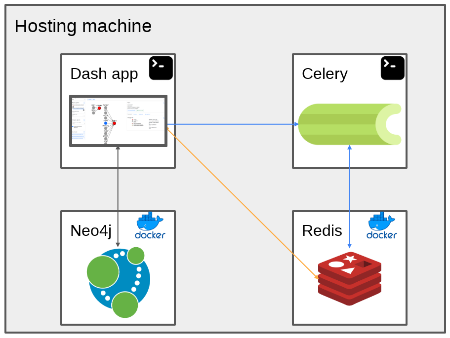

# DysRegNetWeb

## Installation
Clone the repository
``` bash
git clone https://github.com/JohannesKersting/DysRegNetWeb.git
```

Navigate to the folder
``` bash
cd DysRegNetWeb
```

### For development and debugging

#### Launching the web app
Setup a fresh [conda](https://conda.io/projects/conda/en/latest/user-guide/install/index.html) environment with Python 3.8
``` bash
conda create -n DysRegNetWeb python=3.8
```

Activate the environment
``` bash
conda activate DysRegNetWeb
```

Install the required dependencies using pip
``` bash
pip install -r app/requirements.txt
```
Please note that we are running a cutom version of the [cmapPy package](https://pypi.org/project/cmapPy/), which can be found at https://github.com/LanOuyang/cmapPy_custom.git. Reason for this was a string to float conversion error.

Launch the app
``` bash
python app/app.py
```

The web app is now available under http://127.0.0.1:8050/ but the database is not running yet.
Furthermore the long callback for running DysRegNet on the user_data page will also not work.
Together with the session caching these functionalities require further back-end processes running.

### Launching the back-end
The tech stack of this application (in developement) consists of four components.
1. a shell running the dash app
2. a shell running Celery, which is a transaction broker
3. a Neo4j database, provided by a docker container
4. a Redis in-memory database, provided by another docker container



#### Neo4j database
Open a fresh shell and navigate to the repository folder. 
Launch the Neo4j database using [Docker](https://docs.docker.com/engine/install/ubuntu/).
In order for this to work, the repository directory must include a folder called `data` containing the Neo4j database files.
These files, have however not been added to git, due to file size.
``` bash
docker run -it --rm \
    --user "$(id -u):$(id -g)" \
    --name dysregnet-neo4j \
    -p7474:7474 -p7687:7687 \
    -v ${PWD}/data:/data \
    --env NEO4J_AUTH=neo4j/12345678 \
    neo4j:5.11.0
```
If you have user permission problems connected to `--user=$(id -u):$(id -g)`, consider omitting this.
Also, the container can be run in the background using `-d`.
``` bash
docker run -it --rm -d \
    --name dysregnet-neo4j \
    -p 7474:7474 -p 7687:7687 \
    -v ${PWD}/data:/data \
    --env NEO4J_AUTH=neo4j/12345678 \
    neo4j:5.11.0
```

#### Redis in-memory cache
The app [caches session data](https://dash.plotly.com/background-callback-caching) using Celery as a broker and a [Redis](https://redis.io/docs/) database.
The Redis database runs in the RAM and is also used to cache the parameters and results of DysRegNet calls.
First, start the [Redis docker official image](https://www.docker.com/blog/how-to-use-the-redis-docker-official-image/) in a similar fashion to the Neo4j container.
``` bash
docker run -it --rm -d \
    --name dysregnet-redis \
    -p 6379:6379 \
    redis:7.2.4
```
For this you can alternatively, specify the exposed Redis IP more directly using e.g. `-p 127.0.0.1:6379:6379/tcp`.
Afterwards, export the IP address in the shell you are calling `python app/app.py` from and the shell which is running Celery.
``` bash
export REDIS_URL="redis://127.0.0.1:6379"
```

#### Celery broker
The Celery callback manager, needs to be called in a separate terminal or process from the `app` folder, which is the location of `app.py`.
It requires the `REDIS_URL` environment variable, as well as the relative path to the GTEx folder as a second environment variable.
``` bash
cd app/
export REDIS_URL="redis://127.0.0.1:6379"
export GTEX_CONTROL_DATA="../GTEx-data/"
```
Keep in mind to use the conda environment to ensure the same software is called from terminal and the dash app.
For the celery command we need to specify which callback manager variable inside the dash app, we are referring to.
In our case that is `celery_broker` in `app.py`.
``` bash
celery --app app:celery_broker worker --loglevel=INFO --concurrency=2
```
With a multi-page and -component app such as this, the app variable needs to be explicitly referenced in case of background callbacks.
For this, please use `app = dash.get_app()` and `@app.callback` in/on the  respective component/page.
By the way, if you use `print` for debugging in a component, the text will appear in the terminal running celery.

### Test for production
Run docker compose inside the repository folder
``` bash
docker compose up -d
```

